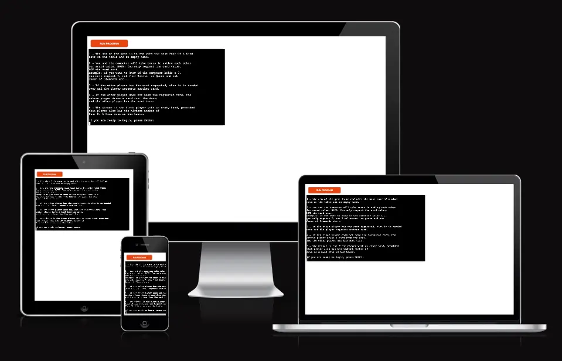
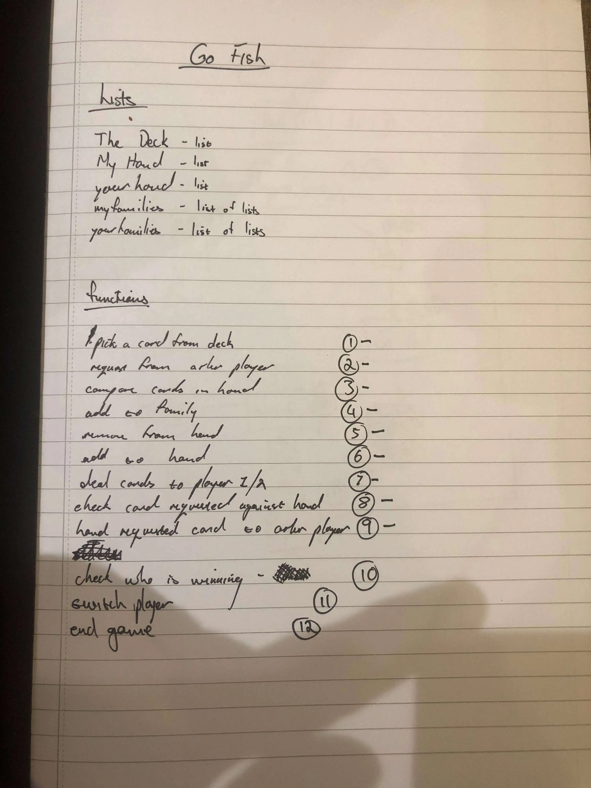
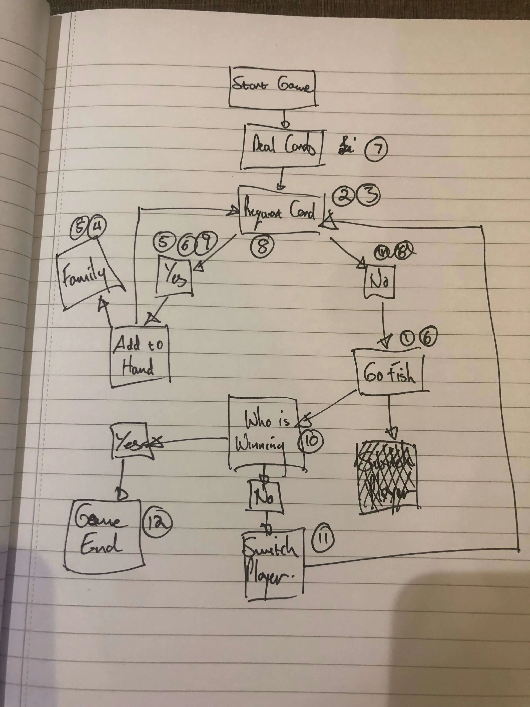
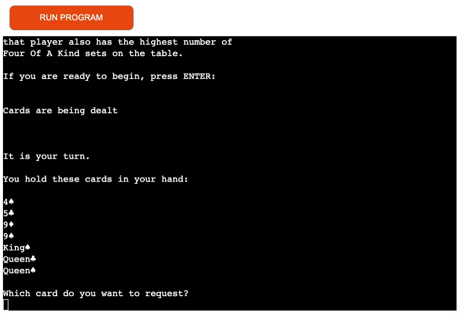
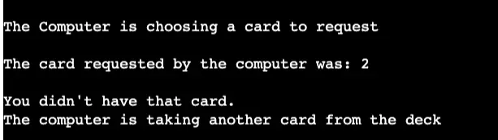
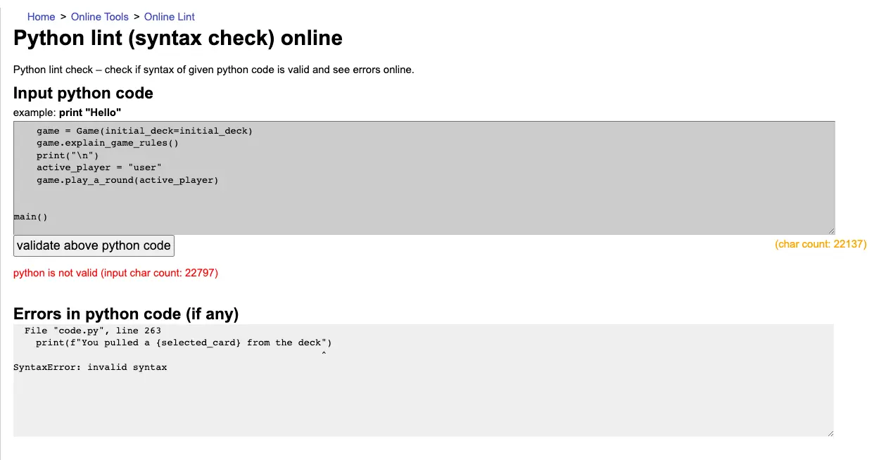
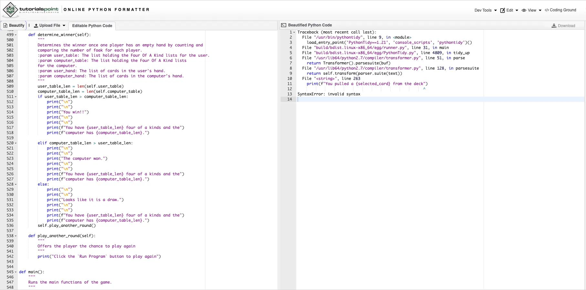
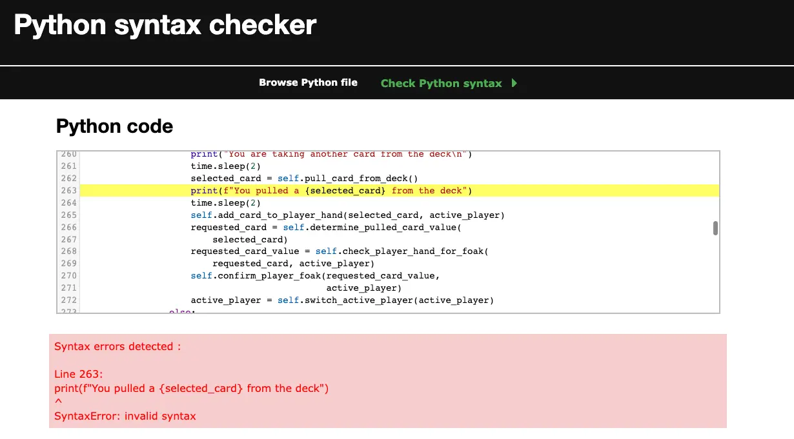

# Go Fish

[View the live project here.](https://go-fish-ci.herokuapp.com/)

The image is from [Am I responsive?](http://ami.responsivedesign.is/)

Go Fish is a terminal based card game aimed at children 6 years and above.

## UX
I aimed to create a story generator game for children that is fun and is very easy to manipulate and input data.

#### The ideal client:
* Children
* English Speaking
* Children who enjoy pattern matching games

### The game will help clients to:
* Navigate easily through the terminal
* Test their short term memory skills
* Provide entertainment

## Owner Stories
1. As the owner, I want the game to be fun and simple to play.
2. As the owner, I want the game to encourage the player to return for more games.
3. As the owner, I want to show my new learned skills with Python.

### User Stories
1. As a new visitor, I want to easily navigate the terminal and play the game.
2. As a visitor, I want to challenge myself to try and beat the computer.

## The skeleton
The game consists of a single page terminal interface, generated with Python.
* The inspiration for the project came from watching my daughters playing this as a real card game in a café in Paris. The sketches / wireframes below show the initial ideas I noted down as I watched them play.

## The Scope
The includes the following features:

### Features
1. A welcome message explaining the rules of the game.
2. Simple in-game notifications confirming who's run it is, what cards are held and requested.
3. In-game score report, showing the status of each player's Four Of A Kind table.
4. The user is offered the opportunity to play another game at the end of an active game.

### Future features
In the future I would like to add the following features:
* Multi-player - ability to have more than one player against the computer.
* Improved deck / hand display, although this might be limited by the terminal output.

## The Design
As this is a childrens game, the interface and the game format is kept simple.
* I imported `time` to allow for a slowed-down display of the terminal message, to help with keeping track of where the game is up to.

## Technologies Used
* [Gitpod](https://gitpod.io/workspaces) - Used for writing the code and git management.
* [Github](https://github.com/) - Used to host the repository.
* [Heroku](https://id.heroku.com/login) - Used to host the live game.
* [pylint](https://pypi.org/project/pylint/) - Used to validate my code and check for errors.

## Testing
1. As a new visitor, I want to easily navigate the terminal to play the game.
* Once the user has read the rules, they only need to press `Enter` in order to start the game.
* The user then receives a notice that the cards are being dealt, as well as a list of the cards they now hold in their hand.

2. As a visitor, I want to challenge myself to try and beat the computer.
* The player does not know what cards the Computer holds, but because the computer and the player can only request a card to a value of at least one of the cards they already hold, the player can infer what cards the computer has, based on past requests from the computer.

 ### Additional Testing
* I used the pep8online linter to review my code and highlight issues.
* I carried out a lot of game testing as I wrote the game, confirming behaviour and outcomes with temporary print statements.
* Tested on the Heroku terminal as I set up automatic deployment so I was able to see exactly how the game was generated.

 ## Compatibility
To ensure that a broad range of users can successfully view/use the site, I tested it across all major browsers on both desktop and mobile.
* Chrome
* Mozila Firefox
Whilst the app loads on mobile devices, interaction with the terminal is not possible.
* A note on Safari: The interface loads in MacOS Safari, but the terminal interface is unresponsive. As I was not responsible for creating the interface, I did not try to rectify this issue.

## Validation
I used three different linters to check my code. All three gave the same error, relating to the syntax for an f-string. As there is no actual error in the sysntax for this f-string, I conclude that the python version in the linter is an older version, before f-strings were released.

## Deployment
This project was developed using Heroku, committed to git and pushed to GitHub using git commands. You can [clone this repository here](https://github.com/pieterkdevilliers/go-fish)

To deploy this page to Heroku from GitHub repository, the following steps were taken:

1. In the Heroku dashboard I selected 'New' in the top right hand corner and clicked on 'Create new app'.
2. Then I Created the App name and Choose my region as Europe. Then selected 'Create app'
4. Then I selected Settings tab, and scrolled down to 'Buildpacks'. Here I added 'Python' clicked saved changes and then selected 'Node.js' and saved my changes again.
5. On top of the page I clicked on the 'Deploy' section, and I selected Github as my deployment method.
6. Then I selected 'Connect to Github, and searched for my repository name and clicked on 'Connect' to link my Heroku app to my Github repository code.
7. Scrolling down I have selected 'Enable Automatic Deploys' and after this I selected 'Deploy Branch' to deploy my project. I had to wait for it to build.
8. After it has successfully deployed a 'view' button appeared which took me to my deployed app.

## Credits
* Whilst the game itself is really simple, the underlying rules and possibilities of card options and card tracking in the deck, player hands and player Four Of A Kind proved to be a very interesting and enjoyable challenge. 
* I used several google searches to find answers to different questions, taking care not to directly copy anyone's code for my project. Helpful articles I found were:
   1. [Retrieving partial matches from a list of strings](https://stackoverflow.com/questions/64127075/how-to-retrieve-partial-matches-from-a-list-of-strings)
   2. [Find all index position in list based on partial string inside item in list](https://stackoverflow.com/questions/14849293/find-all-index-position-in-list-based-on-partial-string-inside-item-in-list)
   3. [How to get the first word in the string](https://stackoverflow.com/questions/13750265/how-to-get-the-first-word-in-the-string)
   4. [How do I make a time delay?](https://stackoverflow.com/questions/510348/how-do-i-make-a-time-delay)
   5. [How To Reference Nested Python Lists & Dictionaries](https://packetpushers.net/how-to-reference-nested-python-lists-dictionaries/)
* This README documents structure, including the Welcome and Goodbye message is based on the one used [by MiaTothova here](https://github.com/MiaTothova/story-vault)
* My Mentor Guido Cecilio Garcia Bernal was extremely helpful as always.
